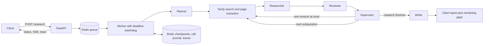

# Multi-Agent Research Assistant

A research service that turns a question into a cited report and a viewable execution
trace. Planner, Researcher, Reviewer, and Writer specialists use typed handoffs.
A deterministic LangGraph supervisor controls work, with Redis checkpoints, token
reservations, bounded search, and one revision per run.

**Python 3.14 · LangChain/OpenAI · LangGraph · Tavily · Redis · FastAPI**

This repository grew from individually tested specialists into a recoverable service.
It includes a synthetic demo that runs without provider calls, unit/HTTP tests, and
real Redis tests that kill and restart worker processes.

## Architecture



```text
src/multi_agent_research_assistant/
  agents/          prompts and specialist validation
  domain/          Pydantic handoffs, run state, evidence and citation checks
  llm/             structured calls, token counting, budget enforcement, tracing
  orchestration/   LangGraph nodes, supervisor routing, budget policy
  retrieval/       Tavily search/extract, URL normalization, source limits
  storage/         Redis queue, worker leases, journals, LangGraph checkpointer
  api/             research/status/trace endpoints and SSE progress
  smoke/           explicitly invoked live checks
  config.py        environment settings
  runtime.py       provider construction and checkpoint resume
  worker.py        durable work loop and process deadline enforcement
  demo.py          clearly labeled synthetic providers
tests/
  unit/            offline contracts, failure paths, HTTP and persistence tests
  integration/     real Redis, real HTTP, process-kill and deadline tests
docs/
  architecture.md  guarantees and tradeoffs
  interview.md     questions to practice and a demo walkthrough
  verification.md observed checks and their limits
```

## Run locally

Install [uv](https://docs.astral.sh/uv/) and Docker. On a fresh checkout, copy
`.env.example` to `.env`; preserve an existing `.env`.

```bash
uv sync --frozen
docker compose up -d redis
```

Run a complete **synthetic** demonstration with Redis, without calling either provider:

```bash
uv run multi-agent-research-assistant demo
```

The demo prints its run ID, cited report, synthetic token usage, elapsed time, and
trace length. Its `example.com` sources are fixtures, not retrieved webpages.

To expose the synthetic workflow through the API, run these in separate terminals:

```bash
RESEARCH_MODE=demo uv run multi-agent-research-assistant serve
```

```bash
RESEARCH_MODE=demo uv run multi-agent-research-assistant worker
```

Open [API docs](http://localhost:8000/docs). For live research, set
`OPENAI_API_KEY`, `TAVILY_API_KEY`, and `RESEARCH_MODE=live` in `.env`, then restart
both processes. The configured model defaults to `gpt-5.4-mini`.

For a containerized deployment:

```bash
docker compose up --build
```

Or use `RESEARCH_MODE=demo docker compose up --build` for synthetic providers.
Redis uses a named volume and AOF with `appendfsync always`. Normal container
restarts preserve the volume. Removing the volume intentionally removes run history.

The API and Redis ports bind to localhost. Set `API_TOKEN` before exposing the API
elsewhere; pass it as `Authorization: Bearer <token>`. This is a single-user
portfolio service, not a multi-tenant authorization system.

## Submit and inspect a run

```bash
curl -sS http://localhost:8000/research \
  -H 'Content-Type: application/json' \
  -H 'Idempotency-Key: retention-demo-1' \
  -d '{"question":"How long are completed and failed runs retained?"}'
```

Use the returned ID:

```bash
curl -sS http://localhost:8000/research/RUN_ID
curl -N http://localhost:8000/research/RUN_ID/events
curl -sS http://localhost:8000/research/RUN_ID/trace
```

| Endpoint | Behavior |
| --- | --- |
| `POST /research` | Validates input, enqueues durably, returns 202 and a run ID |
| `GET /research/{id}` | Status, progress, budget, report, citations, remaining gaps |
| `GET /research/{id}/events` | SSE step events and progress; supports `Last-Event-ID` |
| `GET /research/{id}/trace` | Prompts, schemas, outputs, tools, tokens, latency, failures |
| `GET /health` | Redis connectivity and configured mode |

Repeating an idempotency key with the same request returns the original run.
Reusing it for different input returns 409. Queue admission is bounded.
Terminal statuses are `completed`, `partial`, `failed`, or `timed_out`.

You may supply a `limits` object with the request. Defaults:

| Limit | Default |
| --- | ---: |
| Planned subquestions | 3 |
| Search attempts per subquestion | 2 |
| Extra research passes across the entire run | 1 |
| Total model input + output tokens | 24,000 |
| Maximum output tokens per model call | 2,000 |
| Wall-clock ceiling, including queue time | 240 seconds |
| Sources selected per search | 3 |
| Unique extracted pages per registered domain | 2 |

Limits are enforced in code. Every generation reserves the counted structured
input plus its enforced output allowance. Actual usage settles the reservation.
Automatic SDK retries are disabled. Missing or inconsistent usage blocks further
generation. `usage_complete=false` means recorded tokens are a known lower bound,
not a measured zero-cost run. Token and search caps bound resource use; this
project does not promise an exact dollar limit across provider pricing changes.

## Evidence and recovery

Search results discover URLs. A separate Tavily Extract request fetches page
content; search snippets never become finding evidence. URL deduplication and site
caps apply across subdomains, and extracted pages can be reused across subquestions.
Each page contributes up to 16,000 characters to model context. Extraction failures
are structured outcomes, including no results, rate limiting, paywall, timeout,
and unavailable content.

Findings retain claim, source URL, verbatim excerpt, retrieval time, and ID.
The Reviewer decides which findings are usable and which criteria remain unmet.
The Writer receives accepted findings. Every returned claim's citation IDs are
validated against those records, and incomplete coverage is displayed.

Redis saves graph snapshots after nodes. A separate journal atomically saves each
node result, resulting run state, and trace. Re-entering a completed node uses its
cached result, even if the process died before the next graph checkpoint.

**Recovery has an intentional uncertainty policy:** if a process dies during an
external operation, its result may be unknowable. The system does not repeat that
operation blindly. An open token reservation becomes unknown usage; further
model calls stop and any previously accepted findings form a partial report.
See [architecture](docs/architecture.md) for the exact guarantees.

## Verify

Offline suite:

```bash
uv run ruff check src tests
uv run ruff format --check src tests
uv run pytest -q
```

Full suite, including real Redis and process-kill tests:

```bash
TEST_REDIS_URL=redis://localhost:6379/0 uv run pytest -q
```

The integration tests use unique Redis namespaces and remove only their own keys.
They test both a completed-node crash and an in-flight reservation crash, as well as
the worker watchdog and a real HTTP API-to-worker run. CI runs the full suite.

Explicitly invoked live checks consume provider quota:

```bash
uv run python -m multi_agent_research_assistant.smoke.smoke_budgeted_planner
uv run python -m multi_agent_research_assistant.smoke.smoke_pipeline
```

The first caps generation at 600 output tokens and the run at 4,000 total tokens.
The full pipeline check uses one subquestion, one search, a 12,000-token cap, and a
120-second deadline. It requires both provider keys and Redis.

See [verification results](docs/verification.md) and [interview practice](docs/interview.md).

